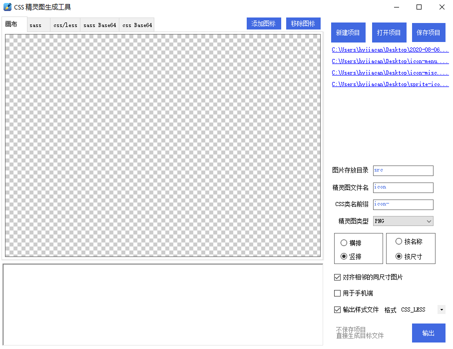

# css sprite

> 此仓库 Fork 自 [iwangx/sprite](https://github.com/iwangx/sprite)，感谢作者 @iwangx 开源此项目

新增功能：

- 最近项目列表
- 支持相同尺寸的图标自动排列在同一行(列)
- 支持直接输出精灵图和样式文件（不需要保存为项目）
- 支持处理中文文件名为拼音，并将特殊符号处理成 `-`

以下为原仓库的描述：

css雪碧图简单制作工具

可以通过图片，直接生成sprite文件，并且生成代码

可以通过鼠标点击调整图片位置

可以添加单张图片，以及删除单张图片

可以保存为.sprite文件，以后好维护

## 待办

- [ ] 添加 文件列表展示框，可以直观看到文件名以及其预览
- [ ] 文件列表中，可以对图片进行移除/替换等操作
- [ ] 优化 工程文件处理，当前若是打开了工程文件，则直接保存即可
- [ ] 若添加的图标来自工程下的 src 目录，那么不需要再移动图标
- [ ] **bug** 打开项目/新建项目时，未移除已经存在的图标
- [x] 自动将中文转换成拼音(可以在选中图标后编辑)
